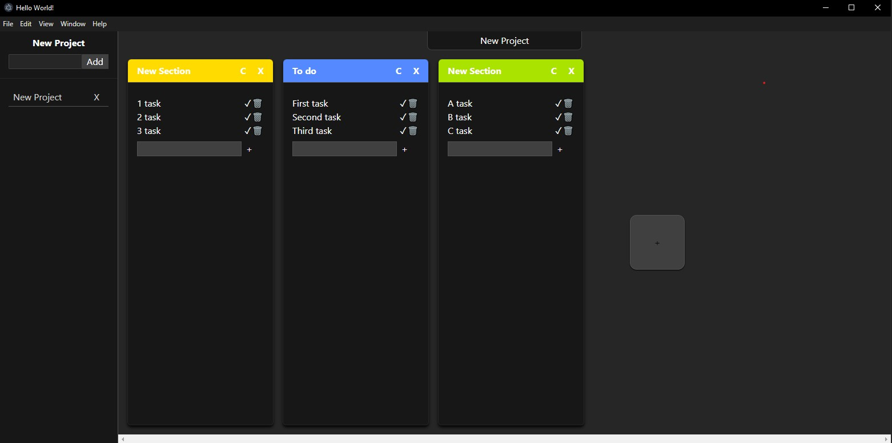
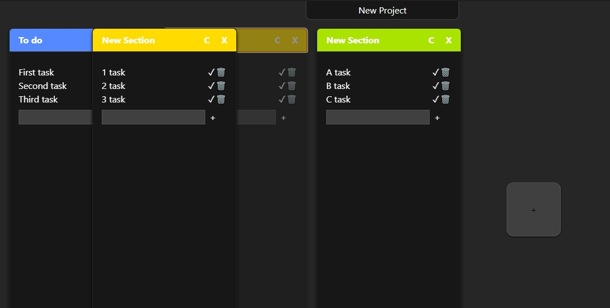
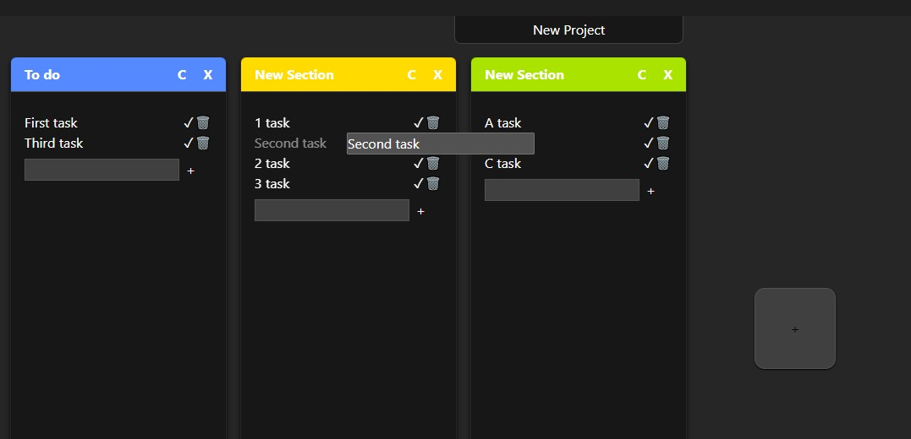
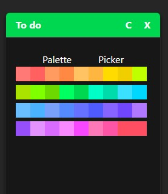
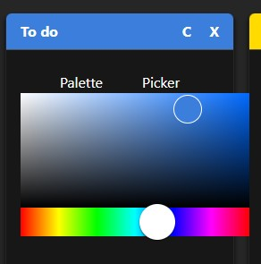

# Kanban Desktop App

A kanban-style desktop application designed to make it easier to organize work on projects and tasks. Users can create kanban boards for different projects, add sections and tasks to them. With drag-and-drop functionality, sections and tasks can be easily reordered and tasks can be moved between sections, facilitating dynamic workflow management.

The application also includes its own color picker for customizing section colors, allowing for better personalization of the board.

## Project status

Most of the application's features are already implemented. What remains to complete the project is mainly interface styling, possible optimizations of the application's performance, and adding safeguards against potential errors.

## Technologies

- TypeScript, Electron, React, Node, Tailwind CSS
- Drag-and-drop based on the dnd-kit library

## Data storage

Project data is saved in JSON files with each change, ensuring that the application is safely shut down at any time without risk of data loss.

## App view (not finished styling)

<h3 align="center">Full view</h4>

    

<h3 align="center">Drag and drop</h4>

    

    

<h3 align="center">Color changing</h4>

    
    

